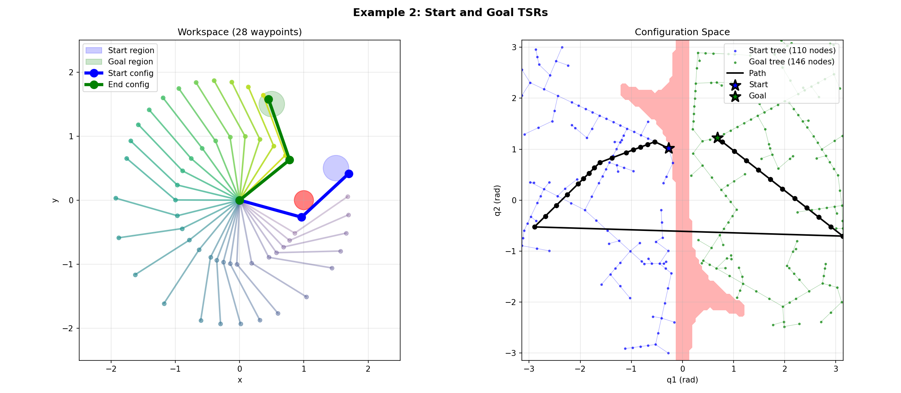

# pycbirrt

A Python implementation of the Constrained Bi-directional Rapidly-exploring Random Tree (CBiRRT) algorithm for robot motion planning with Task Space Region (TSR) constraints.

## Features

- **Bidirectional search**: Grows trees from both start and goal for faster convergence
- **TSR constraints**: Define start regions, goal regions, and trajectory-wide constraints
- **Multiple planning modes**: Supports CON-CON, EXT-EXT, EXT-CON, and CON-EXT variants
- **Path smoothing**: Built-in shortcut-based path smoothing
- **Pluggable backends**: Works with any robot model, IK solver, and collision checker

## Installation

```bash
uv pip install -e ".[all]"
```

Or install with specific backends:

```bash
uv pip install -e ".[mujoco,eaik]"
```

## Quick Start

```python
import numpy as np
from tsr import TSR
from pycbirrt import CBiRRT, CBiRRTConfig

# Define your robot model, IK solver, and collision checker
# (see Interfaces section below)
robot = YourRobotModel()
ik_solver = YourIKSolver()
collision_checker = YourCollisionChecker()

# Create planner
config = CBiRRTConfig(step_size=0.1, timeout=30.0)
planner = CBiRRT(robot, ik_solver, collision_checker, config)

# Define goal as a TSR (Task Space Region)
goal_pose = np.eye(4)
goal_pose[:3, 3] = [0.5, 0.3, 0.2]  # Target position
goal_tsr = TSR(
    T0_w=goal_pose,
    Tw_e=np.eye(4),
    Bw=np.array([
        [-0.05, 0.05],  # x tolerance
        [-0.05, 0.05],  # y tolerance
        [-0.05, 0.05],  # z tolerance
        [0, 0], [0, 0], [0, 0],  # rotation (fixed)
    ]),
)

# Plan
start_config = np.array([0.0, 0.0, 0.0, 0.0, 0.0, 0.0])
path = planner.plan(start_config, goal_tsrs=[goal_tsr])

if path is not None:
    print(f"Found path with {len(path)} waypoints")
```

## Algorithm Overview

CBiRRT extends the classic RRT-Connect algorithm to handle task space constraints. It's particularly useful for manipulation tasks where the end-effector must reach a region (not just a point) or follow constraints during motion.

### How It Works

The algorithm grows two trees simultaneously—one from the start configuration and one from the goal—attempting to connect them:

1. **Sample**: Generate a random configuration (with bias toward the goal region)
2. **Extend**: Grow the nearest tree node toward the sample
3. **Project**: If path constraints exist, project new configurations onto the constraint manifold
4. **Connect**: Try to connect the two trees
5. **Smooth**: Once connected, apply shortcutting to reduce path length

### Visualizing the Algorithm

The figures below show CBiRRT planning for a 2-DOF planar arm. The left panel shows the robot in **workspace** (physical space), and the right panel shows the search in **configuration space** (joint angles).

#### Example 1: Basic Planning

A fixed start configuration reaching a goal region while avoiding obstacles.


The blue tree grows from the start (arm pointing right), and the green tree grows from the goal region. Red areas in C-space show configurations that would cause collision with obstacles.

#### Example 2: Start and Goal TSRs

Both start and goal are defined as regions, not fixed configurations. The planner samples valid configurations from each TSR.



#### Example 3: Trajectory Constraints

The end-effector must stay within a horizontal band (yellow region) throughout the entire motion. This requires projecting each new configuration onto the constraint manifold.


Notice how the path in workspace stays within the yellow constraint band.

## Task Space Regions (TSRs)

TSRs define regions in task space using a reference frame and bounds:

```python
from tsr import TSR

# TSR centered at (1.0, 0.5, 0.0) with position tolerance
tsr = TSR(
    T0_w=np.array([        # Reference frame in world
        [1, 0, 0, 1.0],
        [0, 1, 0, 0.5],
        [0, 0, 1, 0.0],
        [0, 0, 0, 1.0],
    ]),
    Tw_e=np.eye(4),        # End-effector frame in TSR
    Bw=np.array([          # Bounds: [min, max] for each DOF
        [-0.1, 0.1],       # x
        [-0.1, 0.1],       # y
        [0, 0],            # z (fixed)
        [0, 0],            # roll
        [0, 0],            # pitch
        [-np.pi, np.pi],   # yaw (free rotation)
    ]),
)
```

TSRs can be used for:
- **Goal regions**: Where the end-effector should reach
- **Start regions**: Valid starting poses (planner samples from these)
- **Path constraints**: Constraints that must hold along the entire trajectory

## Configuration Options

```python
from pycbirrt import CBiRRTConfig

config = CBiRRTConfig(
    # Termination
    timeout=30.0,              # Wall-clock timeout in seconds
    max_iterations=100000,     # Safety limit
    tsr_tolerance=1e-3,        # Distance tolerance for TSR satisfaction
    progress_tolerance=1e-6,   # Minimum progress to continue growing

    # Tree growth
    step_size=0.1,             # Maximum joint space step per iteration
    goal_bias=0.1,             # Probability of sampling from goal TSR
    start_bias=0.1,            # Probability of sampling from start TSR

    # Extension behavior (None = connect until blocked, int = limited steps)
    extend_steps=None,         # Steps when extending toward random sample
    connect_steps=None,        # Steps when connecting to other tree

    # Constraint projection
    max_projection_iters=50,   # Max iterations for projecting onto constraints

    # Path smoothing
    smooth_path=True,
    smoothing_iterations=100,

    # Joint types (for proper distance calculation)
    angular_joints=None,       # Tuple of bools, True = revolute joint
)
```

### Planning Variants

The `extend_steps` and `connect_steps` parameters control tree growth behavior:

| extend_steps | connect_steps | Variant | Description |
|-------------|---------------|---------|-------------|
| None | None | CON-CON | Both trees connect until blocked (default) |
| 5 | 5 | EXT-EXT | Both trees take limited steps |
| 5 | None | EXT-CON | Extend limited, connect unlimited |
| None | 5 | CON-EXT | Extend unlimited, connect limited |

## Interfaces

pycbirrt uses Protocol classes for dependency injection. Implement these for your robot:

### RobotModel

```python
class MyRobot:
    @property
    def dof(self) -> int:
        return 6

    @property
    def joint_limits(self) -> tuple[np.ndarray, np.ndarray]:
        return np.array([-np.pi]*6), np.array([np.pi]*6)

    def forward_kinematics(self, q: np.ndarray) -> np.ndarray:
        """Return 4x4 end-effector pose."""
        ...
```

### IKSolver

```python
class MyIKSolver:
    def solve(self, pose: np.ndarray) -> list[np.ndarray]:
        """Return all IK solutions (may include invalid ones)."""
        ...

    def solve_valid(self, pose: np.ndarray) -> list[np.ndarray]:
        """Return only valid solutions (within limits, collision-free)."""
        ...
```

### CollisionChecker

```python
class MyCollisionChecker:
    def is_valid(self, q: np.ndarray) -> bool:
        """Return True if configuration is collision-free."""
        ...
```

## Backends

Optional backends for common robotics libraries:

### MuJoCo

```python
from pycbirrt.backends.mujoco import (
    MuJoCoRobotModel,
    MuJoCoCollisionChecker,
    MuJoCoIKSolver,
)

model = mujoco.MjModel.from_xml_path("robot.xml")
data = mujoco.MjData(model)

robot = MuJoCoRobotModel(model, data, ee_site="end_effector")
collision = MuJoCoCollisionChecker(model, data)

# Differential IK solver (no external dependencies)
ik = MuJoCoIKSolver(
    model, data,
    ee_site="end_effector",
    collision_checker=collision,
)
```

### EAIK (Analytical IK)

```python
from pycbirrt.backends.eaik import EAIKSolver

ik = EAIKSolver(
    "robot.urdf",
    joint_limits=(lower, upper),
    collision_checker=collision,
)
```

## Examples

Run the planar arm examples:

```bash
python examples/planar_arm.py           # Run all examples
python examples/planar_arm.py -e 1      # Basic planning
python examples/planar_arm.py -e 2      # Start/goal TSRs
python examples/planar_arm.py -e 3      # Constrained planning
```

## References

- Berenson, D., Srinivasa, S., Ferguson, D., & Kuffner, J. (2009). [Manipulation planning on constraint manifolds](https://www.ri.cmu.edu/pub_files/2009/5/berenson_icra09_cbirrt.pdf). ICRA.
- Berenson, D., Srinivasa, S., & Kuffner, J. (2011). [Task Space Regions: A framework for pose-constrained manipulation planning](https://www.ri.cmu.edu/pub_files/2011/10/pedestrian_ijrr.pdf). IJRR.

## License

MIT
