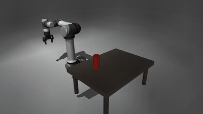
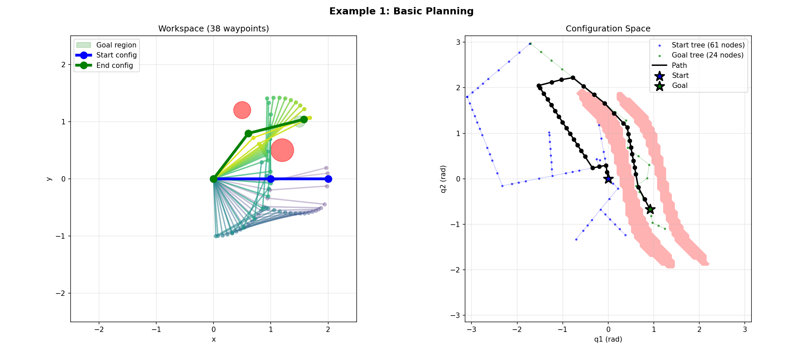
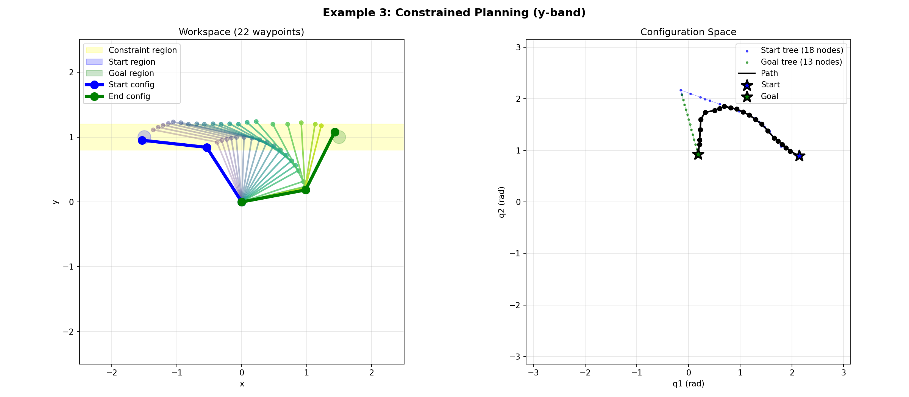

# pycbirrt

A motion planner that finds paths through tight spaces, around obstacles, and into precise grasp poses—even when the goal is a *region*, not a point.

<p align="center">
  
  <br>
  <em>UR5e arm planning side grasps using Task Space Region constraints</em>
</p>

## Why CBiRRT?

Most planners ask: "Can you reach this exact pose?" But manipulation tasks are rarely that rigid. You might need to:

- Grasp a mug from any angle (goal is a *region* of valid grasps)
- Keep a tray level while moving (constraint along *entire* path)
- Start from multiple home positions and reach any of several goals

**CBiRRT** handles all of this. It grows two search trees—one from start, one from goal—and connects them through configuration space while respecting task-space constraints.

## Installation

```bash
# Install TSR dependency (not on PyPI)
uv pip install "tsr @ git+https://github.com/personalrobotics/tsr.git"

# Install pycbirrt with all backends
uv pip install -e ".[all]"
```

## Quick Start

```python
import numpy as np
from tsr import TSR
from pycbirrt import CBiRRT, CBiRRTConfig

# Your robot interfaces (see Interfaces section)
robot = MyRobot()
ik_solver = MyIKSolver()
collision_checker = MyCollisionChecker()

# Define a goal region: position with ±5cm tolerance, rotation free around Z
goal_tsr = TSR(
    T0_w=np.eye(4),  # Reference frame at origin
    Tw_e=np.eye(4),  # No offset to end-effector
    Bw=np.array([
        [0.45, 0.55],    # x: 0.5m ± 5cm
        [0.25, 0.35],    # y: 0.3m ± 5cm
        [0.15, 0.25],    # z: 0.2m ± 5cm
        [0, 0],          # roll: fixed
        [0, 0],          # pitch: fixed
        [-np.pi, np.pi], # yaw: free
    ]),
)

# Plan
planner = CBiRRT(robot, ik_solver, collision_checker)
path = planner.plan(start_config, goal_tsrs=[goal_tsr])
```

## How It Works

<p align="center">
  
</p>

The algorithm grows two trees simultaneously—blue from start, green from goal. The right panel shows configuration space; red regions are in collision.

1. **Sample** a random configuration (biased toward goals)
2. **Extend** the nearest tree toward the sample
3. **Project** onto constraint manifolds if path constraints exist
4. **Connect** the two trees when close enough
5. **Smooth** the path by shortcutting

### Constrained Motion

When the task requires constraints along the entire path (e.g., keeping a cup upright), CBiRRT projects each new configuration onto the constraint manifold:

<p align="center">
  
  <br>
  <em>End-effector stays within the yellow band throughout motion</em>
</p>

## Task Space Regions

TSRs define regions in SE(3) using a reference frame and bounds:

```python
from tsr import TSR

# A cylindrical grasp region: free rotation around Z, tight position bounds
grasp_tsr = TSR(
    T0_w=object_pose,     # Reference frame at object
    Tw_e=gripper_offset,  # Gripper offset from TSR frame
    Bw=np.array([
        [-0.01, 0.01],    # x: ±1cm
        [-0.01, 0.01],    # y: ±1cm
        [0, 0],           # z: exact
        [0, 0],           # roll: fixed
        [0, 0],           # pitch: fixed
        [-np.pi, np.pi],  # yaw: full rotation
    ]),
)
```

### Multiple Goal Approaches

Provide multiple TSRs when several approaches are valid—the planner finds the most reachable:

```python
# Top grasp vs side grasp
path = planner.plan(start, goal_tsrs=[top_grasp_tsr, side_grasp_tsr])
```

TSRs are sampled proportionally to their volume, so larger regions (more flexibility) get explored more.

### Multiple Discrete Configurations

You can also provide lists of configurations:

```python
# Start from any of several home positions
path = planner.plan(start=[home1, home2, home3], goal_tsrs=[grasp_tsr])

# Plan to any of several IK solutions
path = planner.plan(start=current, goal=[ik_sol1, ik_sol2, ik_sol3])

# Mix continuous regions and discrete configs
path = planner.plan(
    start=[home_config],
    start_tsrs=[start_region],
    goal=[precomputed_grasp],
    goal_tsrs=[grasp_region],
)
```

## Configuration

```python
from pycbirrt import CBiRRTConfig

config = CBiRRTConfig(
    # Termination
    timeout=30.0,              # Wall-clock seconds
    max_iterations=100000,     # Safety limit
    tsr_tolerance=1e-3,        # Distance for TSR satisfaction

    # Tree growth
    step_size=0.1,             # Max joint-space step per iteration
    goal_bias=0.1,             # Probability of sampling from goal TSR
    start_bias=0.1,            # Probability of sampling from start TSR

    # TSR sampling
    tsr_samples=100,           # Pose samples to try from each TSR
    num_tree_roots=100,        # Target root configs to seed each tree
    max_ik_per_pose=3,         # IK solutions per pose (for diversity)

    # Extension behavior (None = connect until blocked)
    extend_steps=None,         # Steps toward random sample
    connect_steps=None,        # Steps toward other tree

    # Smoothing
    smooth_path=True,
    smoothing_iterations=50,  # Balanced: 2x faster than 100, same path quality
)
```

### Planning Variants

| extend_steps | connect_steps | Behavior |
|-------------|---------------|----------|
| None | None | **CON-CON**: Both trees march until blocked (default, like RRT-Connect) |
| 5 | 5 | **EXT-EXT**: Both trees take limited steps |
| 5 | None | **EXT-CON**: Extend limited, connect unlimited |
| None | 5 | **CON-EXT**: Extend unlimited, connect limited |

## Interfaces

Implement these protocols for your robot:

```python
class RobotModel(Protocol):
    @property
    def dof(self) -> int: ...

    @property
    def joint_limits(self) -> tuple[np.ndarray, np.ndarray]: ...

    def forward_kinematics(self, q: np.ndarray) -> np.ndarray:
        """Return 4x4 end-effector pose."""


class IKSolver(Protocol):
    def solve(self, pose: np.ndarray) -> list[np.ndarray]:
        """Return IK solutions (may include invalid ones)."""


class CollisionChecker(Protocol):
    def is_valid(self, q: np.ndarray) -> bool:
        """Return True if collision-free."""
```

## Backends

### MuJoCo

```python
from pycbirrt.backends.mujoco import (
    MuJoCoRobotModel,
    MuJoCoCollisionChecker,
    MuJoCoIKSolver,
)

robot = MuJoCoRobotModel(model, data, ee_site="end_effector")
collision = MuJoCoCollisionChecker(model, data)
ik = MuJoCoIKSolver(model, data, ee_site="end_effector", collision_checker=collision)
```

### EAIK (Analytical IK for UR robots)

```bash
uv pip install eaik
```

```python
from pycbirrt.backends.eaik import EAIKSolver

ik = EAIKSolver("robot.urdf", joint_limits=(lower, upper), collision_checker=collision)
```

## Examples

```bash
# 2-DOF planar arm visualization
python examples/planar_arm.py           # All examples
python examples/planar_arm.py -e 1      # Basic planning
python examples/planar_arm.py -e 2      # Start/goal TSRs
python examples/planar_arm.py -e 3      # Constrained planning

# UR5e with Robotiq gripper (requires MuJoCo)
python examples/tsr_union_demo.py       # Multiple grasp approaches
```

## References

- Berenson, D., Srinivasa, S., Ferguson, D., & Kuffner, J. (2009). [Manipulation planning on constraint manifolds](https://www.ri.cmu.edu/pub_files/2009/5/berenson_icra09_cbirrt.pdf). *ICRA*.
- Berenson, D., Srinivasa, S., & Kuffner, J. (2011). [Task Space Regions: A framework for pose-constrained manipulation planning](https://www.ri.cmu.edu/pub_files/2011/10/pedestrian_ijrr.pdf). *IJRR*.

## License

MIT
