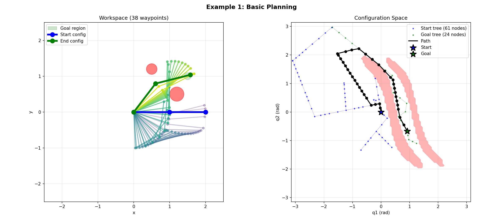
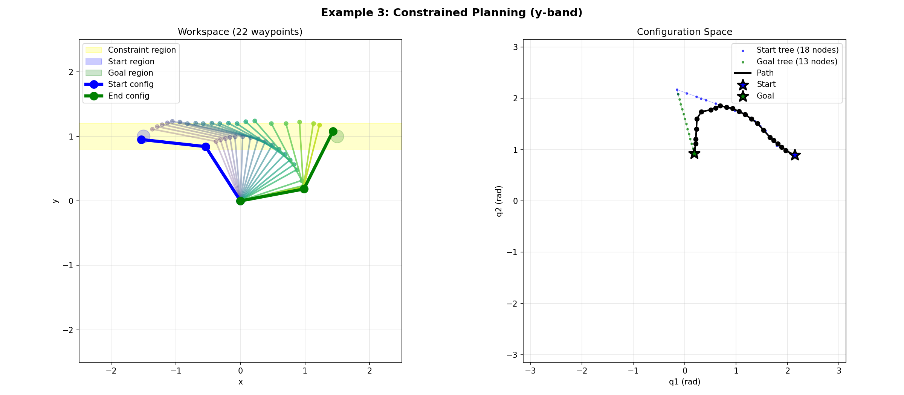
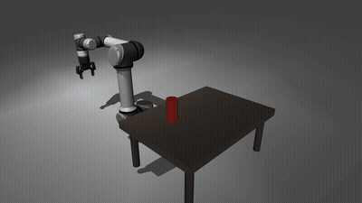

# pycbirrt

A planner over sets of configurations. A planning problem names a start set,
a goal set, a set the whole path must stay inside, and a validity predicate;
a solution is a path that begins in the start set, ends in the goal set, and
stays inside the path set with every configuration valid. A set is anything
that answers `contains(q)`. The algorithm is CBiRRT (Berenson et al., 2009),
a bidirectional RRT that grows trees from many roots and projects onto
constraints. Task Space Regions are one representation of a set; the planner
does not depend on it, and sets you define yourself take the same roles.

## Why sets

A point-to-point planner takes one start configuration and one goal
configuration. Manipulation tasks are not specified that way. A grasp is valid
anywhere around the rim of a mug. A placement is valid anywhere on a shelf.
The arm can begin from any IK solution of its current end-effector pose. A
carried cup must stay upright at every point of the motion, not only at its
ends. Each of these is a set of configurations, and using a point planner
means choosing one member of each set before planning.

That choice is made with the least information available. Whether a given
grasp configuration is reachable from a given start, under a given path
constraint, is what the search determines. Choosing first means the chosen
grasp may collide with the shelf, or lie on an IK branch the arm cannot reach
without leaving the constraint set, and the failure is found only after
planning. The usual remedy is an outer loop over IK solutions and grasp
candidates, replanning each time and rebuilding the same start tree.

Taking the sets moves the choice into the search. Both trees grow from many
roots at once, one per member drawn from the start and goal sets, so every
alternative is explored in one search and the reachable member is found
rather than guessed. Path constraints are enforced during tree growth, by
projecting each new configuration onto the constraint set or rejecting it,
not by filtering the path afterward. The result records which start and goal
member the path uses. And because the planner asks a set for nothing beyond
membership, the sets are open: a pose region, a list of configurations, a
predicate on forward kinematics, or a set of your own design are all admitted
on equal terms.

## What a set is

A state set is anything with `contains(q) -> bool`. The planner never
branches on a set's concrete type. Four capabilities are separate protocols;
a set provides them by defining the method, and `supports(s, Capability)`
asks.

| Capability | Method | Contract |
|---|---|---|
| `SetSampler` | `sample(rng) -> list[Sample]` | candidate members from one draw, unfiltered; the planner validates them |
| `SetDistance` | `distance(q) -> float` | nonnegative geometric distance to the set, before tolerance |
| `SetViolation` | `violation(q) -> float` | nonnegative and exactly zero iff `contains(q)` |
| `SetProjector` | `project(q_previous, q_proposed) -> q or None` | move a configuration onto the set, or give up |

What each role requires:

| Role | Requires | Uses if present |
|---|---|---|
| start, goal | explicit members (a finite set anywhere in the expression) or `SetSampler`, so the tree has roots | `SetDistance` for nearest-member queries |
| path constraint | membership only; an extension that leaves the set is rejected | `SetProjector`, so extensions are projected instead of rejected |
| validator | `is_valid(q)`; applied to every root and every configuration along every edge | |

Composition is explicit. `AnyOf(children, weights)` is the union: a single
child delegates every capability; with several, sampling draws a child by
weight and each `Sample` records which one. `AllOf(children, projection=,
sampling=)` is the intersection: a single child delegates; with several, the
caller names how to project (`MostViolatedProjection`) and how to sample
(`RejectionSampling(source)`), because there is no canonical way to do either
for an intersection. An intersection of finite sets is finite and
enumerable. A `Sample` carries the configuration and a provenance tuple,
the sequence of choices that produced it, which is what
`PlanResult.start_source` and `goal_source` report; a leaf contributes no
choices, so provenance is empty when the set expression has none.

Leaves provided: `FiniteSet(configs, tolerance, metric)`, `PredicateSet(fn)`,
`EmptySet()`, and `TSRConfigurationSet(tsr, robot, ik, space)`, which is
$\{q : \mathrm{FK}(q) \in \mathrm{TSR}\}$ with all four capabilities.

## Quick start

Three roles, three kinds of set: a finite start, a goal induced by a pose
region, and a path constraint written for this problem that only implements
membership. Run against the two-link reference arm in `pycbirrt.testing`.

```python
import numpy as np
from tsr import TSR
from pycbirrt import CBiRRT, CBiRRTConfig, FiniteSet, PlanningProblem, TSRConfigurationSet
from pycbirrt.testing import NoCollision, PlanarArm, PlanarIK

robot, ik, collision = PlanarArm(), PlanarIK(), NoCollision()
planner = CBiRRT(robot, ik, collision, CBiRRTConfig(step_size=0.1, timeout=10.0))

# Goal: end effector within 10 cm of (0, 1.5), orientation free
T = np.eye(4)
T[:3, 3] = [0.0, 1.5, 0.0]
near = TSR(T0_w=T, Tw_e=np.eye(4), Bw=np.array([[-0.1, 0.1], [-0.1, 0.1], [0, 0], [0, 0], [0, 0], [-np.pi, np.pi]]))


class RightOfWall:
    """The end effector stays at x >= -0.2 along the whole path. Membership only."""

    def contains(self, q):
        return robot.forward_kinematics(q)[0, 3] >= -0.2


problem = PlanningProblem(
    space=planner.space,
    start=FiniteSet([np.array([-0.5, 0.5])], metric=planner.space.distance),
    goal=TSRConfigurationSet(near, robot, ik, planner.space),
    validator=collision,
    path_constraint=RightOfWall(),
)
result = planner.solve(problem, seed=0)
result.success        # True
result.path           # 47 waypoints; every one has end-effector x >= -0.2
result.goal_source    # () : the goal is a single leaf, no choice to record
```

The path constraint has no projector, so the planner rejects any extension
that would leave it. Give the class a `project` method and extensions are
pulled onto the set instead, which is what `TSRConfigurationSet` does.

For problems whose sets are all TSRs or configuration lists, `plan(...)` is
the shorthand. It lowers configuration lists to a `FiniteSet` whose members
are roots, TSR lists to an `AnyOf` weighted by TSR volume, and several
`constraint_tsrs` to an `AllOf` with `MostViolatedProjection`:

```python
result = planner.plan(
    start=q_current,                       # or a list of configurations
    goal_tsrs=[grasp_above(object_pose)],  # any of these regions
    constraint_tsrs=[upright],             # all of these, along the whole path
    seed=0,
    return_details=True,
)
```

Two search-strategy components are replaceable on the problem, each with a
default. A custom `motion_validator` owns the whole edge check, and
`RestrictedMotionValidator(base, accepts)` adds a restriction on top of the
default discretized check. A custom `sampler` proposes the free-space
targets the trees grow toward and defaults to the space's uniform sampling;
replacing it trades away probabilistic completeness unless it has full
support over the space. [docs/design.md](docs/design.md) has the
definitions, the composition rules, what the planner requires of each role,
the tolerances, and the reference behavior artifact that pins the planner's
semantics (`python tools/reference_artifact.py --check`).

## Defining your own set

A set is a class. Implement `contains`; add capabilities as the role needs
them.

```python
class MySet:
    def contains(self, q: np.ndarray) -> bool:
        ...                                   # required; the only thing every role needs

    def sample(self, rng: np.random.Generator) -> list[Sample]:
        ...                                   # start/goal roots: every candidate from one draw, unfiltered

    def violation(self, q: np.ndarray) -> float:
        ...                                   # zero iff contains(q); lets strategies rank children

    def project(self, q_previous: np.ndarray, q_proposed: np.ndarray) -> np.ndarray | None:
        ...                                   # path constraints: move q_proposed onto the set, or None
```

Rules the planner relies on: `sample` returns every candidate a draw
produces (for example every IK branch of one pose) and applies no collision
or other external filter, since which branch is valid is the validator's
call; `violation` is on the set's own scale and agrees with `contains` at
zero; `project` may use `q_previous` to seed an iterative solve or to reject
a result that moved too far. Every configuration a set returns is checked
against the joint space and the validator before it is stored, so a set
cannot put an invalid configuration into a tree.

## Task Space Regions

A TSR is a pose region in SE(3): a reference frame `T0_w`, an end-effector
offset `Tw_e`, and bounds `Bw` on x, y, z, roll, pitch, yaw in the reference
frame. `TSRConfigurationSet` lifts it through the robot into the set of
configurations whose end effector lies in the region, and the TSR's geometry
supplies every capability: sampling (draw a pose, solve IK for every
branch), distance and violation (TSR distance of the forward kinematics),
and projection (the closest pose in the region, then IK seeded from the
previous configuration).

```python
from tsr import TSR

grasp_tsr = TSR(
    T0_w=object_pose,     # reference frame at the object
    Tw_e=gripper_offset,  # gripper offset from that frame
    Bw=np.array([
        [-0.01, 0.01], [-0.01, 0.01], [0, 0],  # position: ±1 cm in x and y, exact z
        [0, 0], [0, 0], [-np.pi, np.pi],       # roll and pitch fixed; yaw free
    ]),
)
```

Several TSRs in `goal_tsrs` or `start_tsrs` form a union; sampling is
proportional to each TSR's volume. Configuration lists and TSRs can be mixed
in the same role:

```python
path = planner.plan(start, goal_tsrs=[top_grasp_tsr, side_grasp_tsr])
path = planner.plan(start=[home1, home2, home3], goal_tsrs=[grasp_tsr])
path = planner.plan(start=current, goal=[ik_sol1, ik_sol2, ik_sol3])
path = planner.plan(start=[home], start_tsrs=[start_region], goal=[q_grasp], goal_tsrs=[grasp_region])
```

A `TSRChain` couples TSRs in series (a handle on a swinging door) and defines
one region of end-effector poses. It goes anywhere a TSR goes:

```python
from tsr import TSRChain

door = TSRChain(TSRs=[hinge_tsr, handle_tsr])
path = planner.plan(start_config, goal_tsrs=[door])
```

For chains of two or more TSRs, membership and projection use sstsr's
numerical inverse: each check costs a few milliseconds and can be a false
negative on a hard chain. A chain as a goal is cheap; a chain as a path
constraint pays that on every edge sample.

## Result

`return_details=True` returns a `PlanResult`:

| Field | Meaning |
|---|---|
| `path` | joint waypoints from a start member to a goal member, or `None` |
| `success`, `failure_reason` | `failure_reason` is `None` on success |
| `start_source`, `goal_source` | provenance through the start and goal set expressions |
| `start_index`, `goal_index` | index into the legacy `start`/`goal` list or TSR list; 0 for single inputs |
| `iterations`, `planning_time`, `tree_sizes` | search statistics |
| `tree_start`, `tree_goal` | the two trees, for inspection |

## How it works

<p align="center">
  
</p>

Two trees grow at once, blue from the start set and green from the goal set.
The right panel is configuration space; red regions are in collision.

1. **Sample** a random configuration, or a member of the other role's set
   with probability `goal_bias` / `start_bias`.
2. **Extend** the nearest tree toward it in steps of `step_size`.
3. **Project** each new configuration onto the path-admissible set when a
   path constraint is present.
4. **Connect** the trees when one reaches the other within
   `connection_tolerance` along a validated edge.
5. **Smooth** by shortcutting; a shortcut is kept only if it is shorter and
   passes the same validation as a tree edge.

<p align="center">
  
  <br>
  <em>With a path constraint, the end effector stays within the yellow band throughout the motion.</em>
</p>

<p align="center">
  
  <br>
  <em>UR5e planning into a union of side-grasp regions.</em>
</p>

## Configuration

```python
from pycbirrt import CBiRRTConfig

config = CBiRRTConfig(
    # Termination
    timeout=30.0,                       # Wall-clock seconds
    max_iterations=100000,              # Safety limit
    abort_fn=None,                      # Callable returning True to stop early

    # Tolerances
    membership_tolerance=1e-3,          # TSR distance at which a configuration is in the set
    connection_tolerance=1e-3,          # Joint-space distance at which growth has reached its target
    edge_resolution=None,               # Spacing of validity checks along an edge; None = step_size
    progress_tolerance=1e-6,            # Growth stops when it gains less than this per step
    projection_progress_tolerance=1e-6, # Projection gives up when the violation shrinks less than this

    # Tree growth
    step_size=0.1,                      # Max joint-space step per iteration
    goal_bias=0.1,                      # Probability of sampling from the goal set
    start_bias=0.1,                     # Probability of sampling from the start set
    max_projection_iters=50,            # Iterations to project onto the constraint set

    # Set sampling
    tsr_samples=100,                    # Pose samples to try from each TSR
    num_tree_roots=100,                 # Target root configs to seed each tree
    max_ik_per_pose=3,                  # IK solutions to take per pose sample

    # Extension behavior (None = connect until blocked)
    extend_steps=None,                  # Steps toward a random sample
    connect_steps=None,                 # Steps toward the other tree

    # Smoothing
    smooth_path=True,
    smoothing_iterations=50,
    smoothing_patience=15,              # Stop early after this many attempts without improvement

    # Joints with no limits (see below); None = every joint is bounded
    angular_joints=None,
)
```

`tsr_tolerance` is a deprecated alias that sets both `membership_tolerance`
and `connection_tolerance` and warns.

### Angular joints

Mark a joint angular only if it has **no limits**. The space never infers
this: a bounded joint must have finite limits, and a robot model that
reports an unlimited joint (the MuJoCo model reports ±∞) fails at planner
construction until you either mark the joint angular or give it finite
planning limits. An angular joint ignores whatever limits were stored for
it, samples over one full turn, and its distance wraps at 2π so the planner
may join the trees across the seam. Joints with limits
wider than one turn, such as the UR5e's ±2π joints, are not angular: their
windings are distinct configurations and the planner respects the limits.
Returned paths are unwrapped forward from the start, so on an angular joint
consecutive waypoints never differ by more than a step and an executor can
interpolate them directly. The goal may therefore be re-expressed by a
multiple of 2π.

### Planning variants

| extend_steps | connect_steps | Behavior |
|---|---|---|
| None | None | **CON-CON**: both trees march until blocked (default) |
| 5 | 5 | **EXT-EXT**: both trees take limited steps |
| 5 | None | **EXT-CON**: extend limited, connect unlimited |
| None | 5 | **CON-EXT**: extend unlimited, connect limited |

## Interfaces

```python
class RobotModel(Protocol):
    @property
    def dof(self) -> int: ...

    @property
    def joint_limits(self) -> tuple[np.ndarray, np.ndarray]: ...

    def forward_kinematics(self, q: np.ndarray) -> np.ndarray:
        """Return the 4x4 end-effector pose."""


class IKSolver(Protocol):
    def solve(self, pose: np.ndarray, q_init: np.ndarray | None = None) -> list[np.ndarray]:
        """Return every IK solution, unfiltered; q_init is an optional seed."""


class CollisionChecker(Protocol):
    def is_valid(self, q: np.ndarray) -> bool:
        """Return True if collision-free."""
```

Together with `StateSet`, these are the planner's extension points. Each has
a native counterpart in the C++ core (`StateSet`, `StateValidator`,
`ForwardKinematics`, `IKSolver`), and the shipped backends below are
implementations of them, not special cases; see
[Adding an integration](#adding-an-integration).

## Installation

```bash
# From a checkout: every backend, the example dependencies, and the dev tools
uv pip install -e ".[all]"

# Or choose extras: mujoco, ssik (recommended IK), examples (matplotlib, mediapy)
uv pip install -e ".[mujoco,ssik]"
```

`numpy` and `sstsr` (Task Space Regions, imported as `tsr`) are installed as
dependencies. Wheels include the native core with the SSIK and MuJoCo
adapters; installing from a checkout or the sdist compiles them and needs
CMake 3.16+, a C++20 compiler, and Eigen 3 (the build fetches
scikit-build-core, pybind11, ninja, ssik, and mujoco itself).

## Backends

pycbirrt ships three integrations. Each implements one interface the core
defines and each lives in its own module, so none is required by the others:

| Integration | Implements | C++ target | Python |
|---|---|---|---|
| Task Space Regions (`sstsr`) | `StateSet` | `sscbirrt::tsr` | `pycbirrt.tsr_set` |
| SSIK | `ForwardKinematics`, `IKSolver` | `sscbirrt::ssik` (the only target that uses Eigen) | `pycbirrt.backends.ssik`, `native_ssik` |
| MuJoCo | `StateValidator` | `sscbirrt::mujoco`, module `pycbirrt._native_mujoco` | `pycbirrt.backends.mujoco`, `native_mujoco` |

`sscbirrt::core` depends on none of them and on nothing but the C++ standard
library. `import pycbirrt` and the native planner work with no simulator and
no IK library installed; a missing one is reported as a reason, never an
import error. Another simulator or IK library is a fourth module of the same
shape ([Adding an integration](#adding-an-integration)).

### MuJoCo

```python
from pycbirrt.backends.mujoco import MuJoCoCollisionChecker, MuJoCoIKSolver, MuJoCoRobotModel

robot = MuJoCoRobotModel(model, data, ee_site="end_effector")
collision = MuJoCoCollisionChecker(model, data)
ik = MuJoCoIKSolver(model, data, ee_site="end_effector", collision_checker=collision, seed=0)
```

The differential solver is stateful and, when called without a seed
configuration, tries a few random restarts within each joint's limits. Pass
`seed=` for reproducible runs; `CBiRRT.plan(seed=...)` seeds the planner only.

### Native MuJoCo scene (collision checking in C++)

With `pycbirrt[mujoco]` (pinned to `mujoco==3.14.0`, the version the extension
is built against), collision checking can run natively against a MuJoCo world
the planner owns:

```python
from pycbirrt.backends.native_mujoco import NativeScene, Snapshot, NativeCollisionChecker

scene = NativeScene.from_model(model, joint_names)              # an owned mjModel from the compiled model's MJB bytes
snap = Snapshot.capture(scene, data, attachments={"can": ("robot/gripper/base", T_gripper_can)})
checker = NativeCollisionChecker(scene, snap)                   # a CollisionChecker for either backend
```

One call does all of it from a live world, with SSIK for the pose regions:

```python
from pycbirrt.backends.native_mujoco import plan_native

result = plan_native(model, data, joint_names, ik=ssik_solver, start=q_now, goal_tsrs=[grasp_tsr],
                     attachments={"can": ("robot/gripper/base", T_gripper_can)}, seed=0)
result.provenance   # versions, scene MJB hash, snapshot hash, SSIK family
```

The snapshot is a value: `qpos`, mocap poses, and attachments copied at capture,
so later changes to `data` do not reach a running solve. Downstream integration
is described in [docs/migration-mj-manipulator.md](docs/migration-mj-manipulator.md). The contact policy is
mj_manipulator's (a grasped object may touch its gripper; everything else that
touches the robot is a collision) and is checked against it on a checked-in
corpus. `PlanResult.provenance` records the scene's MJB hash and the snapshot
hash alongside the dependency versions; `PlanResult.stats` breaks the solve's
cost down by component on both backends.

### SSIK (analytical IK, recommended)

```bash
uv pip install "pycbirrt[ssik]"   # ssik >= 7.0
```

`SSIKRobotModel(ik)` is a `RobotModel` whose forward kinematics and limits
come from the wrapped manipulator, for planning without a simulator.

SSIK solves 6R and 7R arms in closed form, accepts a seed, and returns every
in-limit winding of each geometric branch on joints wider than one turn, so
the planner sees the complete TSR-induced configuration set. The adapter does
no collision checking and applies no solution cap; joint limits are enforced
by `JointSpace` and collision by the planner's validator.

```python
import ssik
from pycbirrt.backends.mujoco import site_offset_in_body
from pycbirrt.backends.ssik import SSIKSolver

# From the same MJCF as the MuJoCo model, so the frames agree to machine precision
arm = ssik.Manipulator.from_mjcf("ur5e.xml", base="world", ee="wrist_3_link")
ik = SSIKSolver(arm, T_ee=site_offset_in_body(model, "attachment_site"))

# Or a prebuilt artifact (vendor nominal geometry) or a URDF
from ssik.prebuilt import ur5e_ik
ik = SSIKSolver(ur5e_ik)
```

The SSIK model and the `RobotModel` must agree on joint order and sign, base
frame, end-effector frame, and which joints are continuous. If the frames
differ by fixed transforms, pass `T_base` and `T_ee` so that
`robot.forward_kinematics(q) == ik.fk(q)`, and assert that before planning.
Prebuilt artifacts use the vendor's nominal geometry and can differ from a
simulator model by a millimeter, which matters at the default membership
tolerance.

### Native core (the default)

The C++20 core in `cpp/` implements the same contract as the Python planner
([docs/native-design.md](docs/native-design.md)). It is built into the wheel
as `pycbirrt._native`, and since 2.0 the planner selects it by default:

```python
planner = CBiRRT(robot, ik, collision, config)                    # backend="auto": native where it can, else Python
planner = CBiRRT(robot, ik, collision, config, backend="native")  # native or NativeUnsupported; never a silent fallback
planner = CBiRRT(robot, ik, collision, config, backend="python")  # the reference implementation, always
result = planner.solve(problem, seed=0)
result.backend          # "native" or "python"
result.backend_reasons  # under "auto": why Python was chosen, one entry per component; also logged at INFO
```

Selection is decided by the problem's components, never by which optional
packages happen to import: a missing extension or adapter is itself one of
the stated reasons. The native core plans problems whose components all have
a native form: finite sets, `AnyOf`/`AllOf` with the named strategies,
`EmptySet`, the validators in `pycbirrt.testing`, any validator or IK solver
that implements the integration protocols below (the MuJoCo scene and SSIK
do), and `TSRConfigurationSet`s whose region is a single `TSR` and whose IK
has a native form (SSIK around an `ssik.Manipulator` of a verified family,
the UR family `ikgeo.three_parallel`). TSRs and SSIK then run entirely in
C++: the TSR math is checked against sstsr on a conformance corpus and the
SSIK adapter against the Python one on the UR5e. Anything else (TSR chains,
Python-only IK, predicates, Python-only validators, samplers, or motion
validators) makes `backend="native"` raise `NativeUnsupported` listing every
blocker, and the default fall back to Python with the same list on the
result. Lowering also checks that the robot model's forward kinematics
agrees with the native IK model's on the problem's explicit configurations.
The native solve releases the GIL and calls no Python after entry. Same
seed, same path within a backend; the two backends agree on outcomes and
validated paths but not on waypoints, because they use different
random-number engines. `tools/reference_artifact.py --backend {python,native,auto} --check`
runs the behavior artifact through each selection.

### Adding an integration

The native lowering (`pycbirrt.backends.native`) recognizes validators and IK
solvers by two protocols, never by type, so a new collision or IK backend
plugs in without a change to pycbirrt:

```python
from pycbirrt.backends.native import ValidatorIntegration, KinematicsIntegration

class MyChecker:                       # a CollisionChecker for the Python backend ...
    def is_valid(self, q) -> bool: ...
    def fresh(self):                   # ... and, for the native one, a sscbirrt StateValidator per solve
        return my_native_module.Validator(self.world_handle)
    @property
    def provenance(self) -> dict:      # what it checked against; merged into PlanResult.provenance
        return {"my_world_sha256": self.world_hash}

class MyIK:                            # an IKSolver ...
    def solve(self, pose, q_init=None) -> list: ...
    def native_kinematics(self):       # ... that is also a sscbirrt ForwardKinematics and IKSolver,
        return my_native_module.Arm(self.spec)   # or raises NativeUnsupported([reason])
    provenance = {"ik_backend": "mine"}
```

On the C++ side, subclass `sscbirrt::StateValidator` (one virtual, `is_valid`)
or `sscbirrt::ForwardKinematics` and `sscbirrt::IKSolver` in a target that
links `sscbirrt::core`, and bind it with pybind11 in your own extension
module, declaring the base registered by `pycbirrt._native` so a native
`PlanningProblem` accepts your object. `NativeCollisionChecker` and
`SSIKSolver` are the two shipped implementations of these protocols and are
the templates to copy. The rules that made them trustworthy apply to a new
one too: the native form and the Python form are one implementation or are
checked against each other on a corpus (MuJoCo: 490 configurations against
mj_manipulator; SSIK: the UR5e artifact), the library version is pinned and
verified at import, and per-solve scratch state comes from `fresh()` so a
validator is never shared between concurrent solves. Lowering itself checks
that your `native_kinematics()` agrees with the problem's `RobotModel` on the
explicit configurations, and refuses with a reason if it does not.

### EAIK (deprecated)

`pycbirrt.backends.eaik.EAIKSolver` still works but warns on construction and
will be removed, with the `eaik` extra, in pycbirrt 2.0. Use SSIK.

## Examples

```bash
uv pip install -e ".[examples]"         # matplotlib and mediapy for plots and video

# 2-DOF planar arm (numpy and sstsr only)
python examples/planar_arm.py           # All examples
python examples/planar_arm.py -e 1      # Basic planning
python examples/planar_arm.py -e 2      # Start/goal TSRs
python examples/planar_arm.py -e 3      # Constrained planning
python examples/multi_config_demo.py    # Several start and goal configurations

# UR5e with Robotiq gripper (requires MuJoCo and the MuJoCo Menagerie)
git clone https://github.com/google-deepmind/mujoco_menagerie.git
export MUJOCO_MENAGERIE_PATH=$PWD/mujoco_menagerie
python examples/ur5e_mujoco.py --no-viz         # Grasp planning with a TSR goal
python examples/tsr_union_demo.py               # Multiple grasp approaches, rendered to video
python examples/ur5e_transport.py --no-viz      # Constrained transport: gripper kept pointing down
```

The UR5e examples accept `--ik {auto,ssik,mujoco}` and `--seed N`; SSIK is
used when installed, otherwise MuJoCo differential IK. Interactive viewing on
macOS needs `mjpython`.

## References

- Berenson, D., Srinivasa, S., Ferguson, D., & Kuffner, J. (2009). [Manipulation planning on constraint manifolds](https://www.ri.cmu.edu/pub_files/2009/5/berenson_icra09_cbirrt.pdf). *ICRA*.
- Berenson, D., Srinivasa, S., & Kuffner, J. (2011). [Task Space Regions: A framework for pose-constrained manipulation planning](https://www.ri.cmu.edu/pub_files/2011/10/pedestrian_ijrr.pdf). *IJRR*.

## License

MIT
